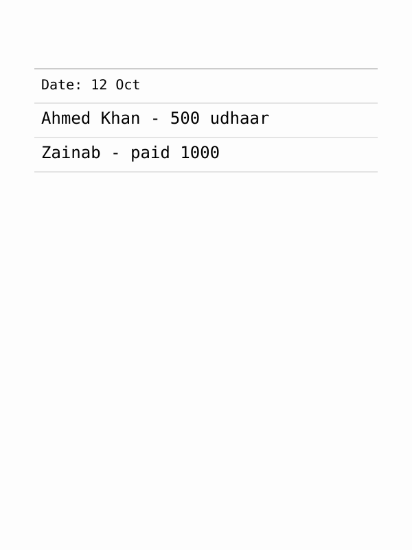
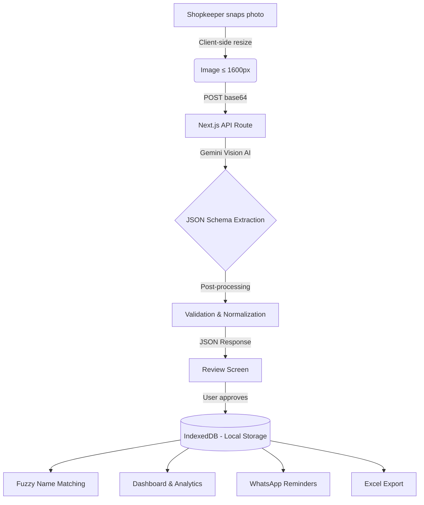

# LedgerLens 📒🔍

**Digitize your handwritten shop ledger with AI.**

*A submission for the EurekaDev 2026 Hackathon (Problem in the Community / Economics).*

 <!-- Replace with a real screenshot/GIF for your final submission -->

---

## 💡 The Problem
Millions of small shopkeepers across South Asia manage customer credit ("udhaar/khata") and daily sales in physical, handwritten paper ledgers. This traditional method is prone to human error, resulting in miscalculated balances, lost pages, and an awkward follow-up process for collecting dues.

## 🚀 The Solution: LedgerLens
LedgerLens is a privacy-first, local web app that empowers shopkeepers to:
1. **Snap a photo** of their handwritten ledger.
2. **Automatically extract** the data using Google's Gemini Vision AI.
3. **Manage balances** and send polite payment reminders via WhatsApp in English, Urdu, or Hindi.

### Key Features
- **Intelligent Extraction:** Reads English, Urdu, Hindi, and Hinglish. Converts Eastern Arabic/Devanagari numerals to standard digits automatically.
- **Privacy First (Local Storage):** Customer data and balances never leave your device. Everything is stored directly in your browser using IndexedDB.
- **Smart Name Matching:** Uses fuzzy matching (Fuse.js) to recognize existing customers even if their names are spelled slightly differently (e.g., "Ahmad" vs "Ahmed").
- **WhatsApp Reminders:** Generates polite, localized payment requests with a single click.
- **Data Export:** Export all transactions and balances to Excel (.xlsx) or CSV for your own records.

---

## 🏗️ Architecture



## 🛠️ Tech Stack & Why We Chose It
- **Next.js (App Router):** For a fast, responsive UI and secure serverless API routes to hide the Gemini API key.
- **Dexie.js (IndexedDB):** Ensures absolute privacy. Financial data is sensitive, so keeping it local-first is a major selling point.
- **Gemini API (@google/genai):** Unparalleled multilingual handwritten OCR and structured JSON output.
- **Tailwind CSS:** For rapid, mobile-first styling (shopkeepers use phones, not laptops).
- **Fuse.js:** Crucial for handling inconsistent handwritten spellings of customer names.

---

## 📊 Evaluation & Accuracy
To ensure LedgerLens works in the real world, we built an automated evaluation script to benchmark the AI extraction against ground-truth data.

**Current AI Accuracy Metrics:**
| Metric | Accuracy |
|--------|----------|
| **Name Recognition** | 100.0% |
| **Amount Extraction** | 100.0% |
| **Direction (Credit vs Payment)** | 100.0% |

*See `docs/EVALUATION.md` for full breakdown and methodology.*

---

## 💻 How to Run Locally

### 1. Clone the repository
```bash
git clone https://github.com/yourusername/LedgerLens.git
cd LedgerLens
```

### 2. Install dependencies
```bash
npm install
```

### 3. Set up Environment Variables
Create a `.env.local` file in the root directory:
```env
GEMINI_API_KEY=your_google_gemini_api_key_here
GEMINI_MODEL=gemini-2.5-flash
```

### 4. Run the development server
```bash
npm run dev
```
Open [http://localhost:3000](http://localhost:3000) in your browser.

### 5. Run tests & evaluation
```bash
npm test         # Runs 88 unit tests via Vitest
npm run eval     # Runs the AI extraction benchmarking script
```

---

## 🤖 How AI Was Used in Building This Project
*Note for Judges: Transparency declaration.*
- **Core Product Feature:** Google's Gemini Vision model is the core engine for digitizing handwritten ledgers via structured JSON extraction.
- **Development Assistance:** AI pair-programming agents were used to scaffold the Next.js boilerplate, write repetitive unit tests for date/currency formatting, and generate the regex logic for numeral conversion. All architecture decisions, prompt engineering, and the privacy-first local storage model were explicitly designed by the developer.

## 🔮 Limitations & Future Work
- Currently bound to browser storage. Future versions could offer encrypted, opt-in cloud sync for cross-device backup.
- Plan to add voice-to-text entry for illiterate shopkeepers who prefer dictating transactions over writing them down.
